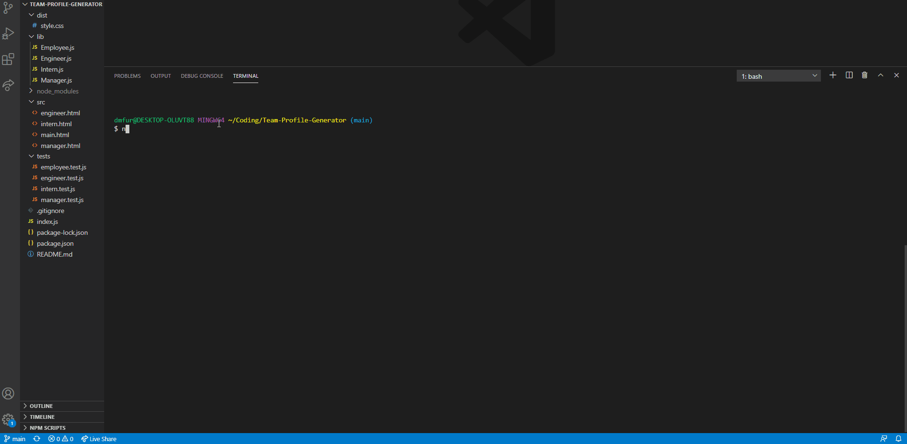

# Team-Profile-Generator
    
## Description
    
This is an application in which a user is prompted with questions using the Inquirer npm to fill the contents of the Team Profile Generator. The application then creates an HTML file with all of the entered information into Bootstrap cards. This application also includes the running of tests.

The purpose of this homework assignment is to practice working further with npms and setting up tests.
       
The user story of this assignment was:
AS A manager
I WANT to generate a webpage that displays my team's basic info
SO THAT I have quick access to their emails and GitHub profiles

## Table of Contents
    
* [Installation](#installation)
    
* [Usage](#usage)
    
* [Contributions](#contributions)
    
* [Tests](#tests)
    
* [License](#license)
    
* [Contact](#contact)
    
## Installation
    
This application requires node.js and the npm Inquirer installed from the terminal with the command 'npm i inquirer'.
    
## Usage
    
Download the code and open using your preferred integrated development environment with node.js installed. Use the command line to run node on the document and follow the prompts to create your team profile. Here is a demo of the application in action:

    
## Contributions
    
Contributions are welcome in the form of suggestions.
    
## Tests
    
This application uses jest npm to test the Employee.js, Engineer.js, Intern.js, and Manager.js files.
    
## License
None
    
    
## Contact
Questions? Contact me at:
 
GitHub username: diane-furlong  
Email address: dfurlongm@gmail.com
